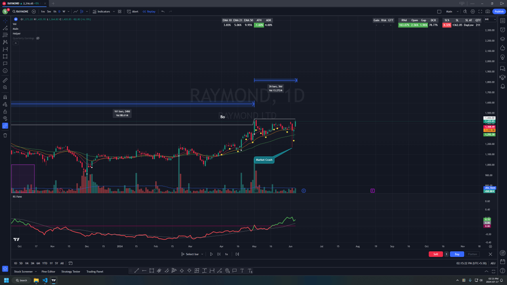
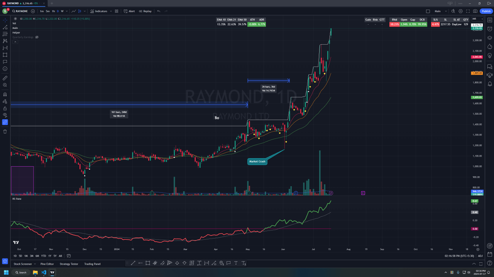

### Base On Base
- Mostly happen when stock breaks out of all time high but didn't rally after that
- stock just consolidate in tight range 10-15% for next 2-4 weeks

### When to Enter
- Depends on Price action but best entries are usually close to 10/21 ema when stock is consolidating tightly
- Another good entry point is inside bar close to breakout
- If base large enough and following trend line then use that for pivot

### When to Exit
- Just Use General Selling rules, I don't have anything concrete yet

### Chart Samples

- Raymond Base on base breakout after market crash
    - 
    - 