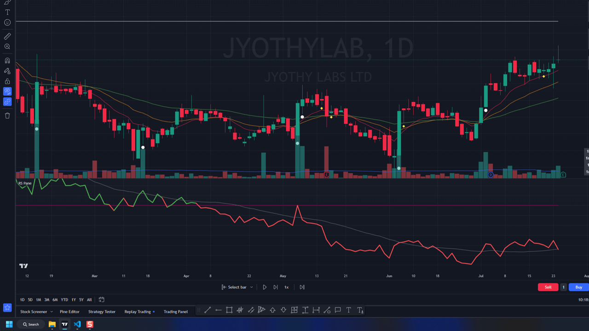
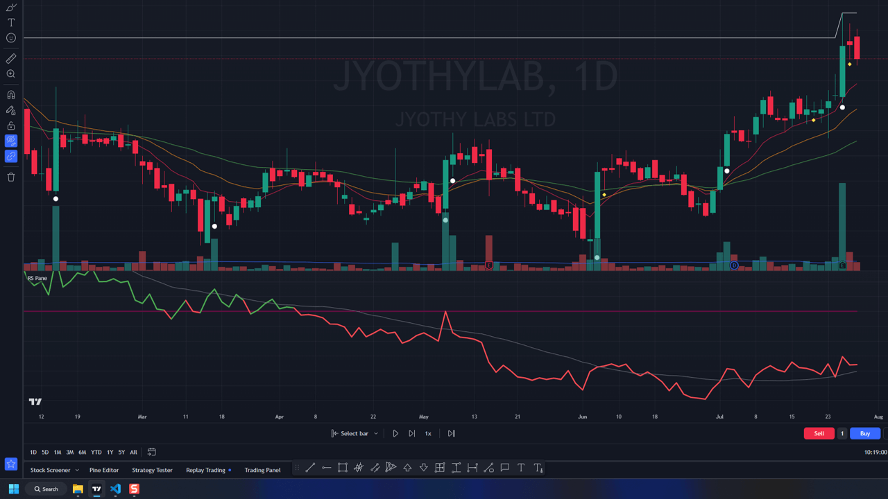

#### Overview
- In earning breakout stock is making good breakout pattern before it's earning release
- But breakout is not happen yet due to earning in next 4-5 days, lot of trader don't like to buy stock when earning is due

### When to enter
- Find low risk setup with volatility contraction
- best time to buy is when quaterly results are annouced, stock becomes very volatile for first 5 min and can give very low risk entry
- Use intraday time frame to take entry

### When to exit
- just use normal selling rules
- If you have really large breakout after earning then sell at 2*ADR or close to any resistance zone like ATH line or previous swing high

### Chart Samples
- 
- 
