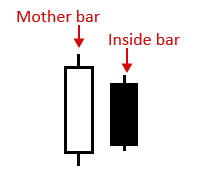
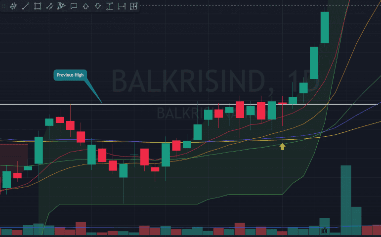
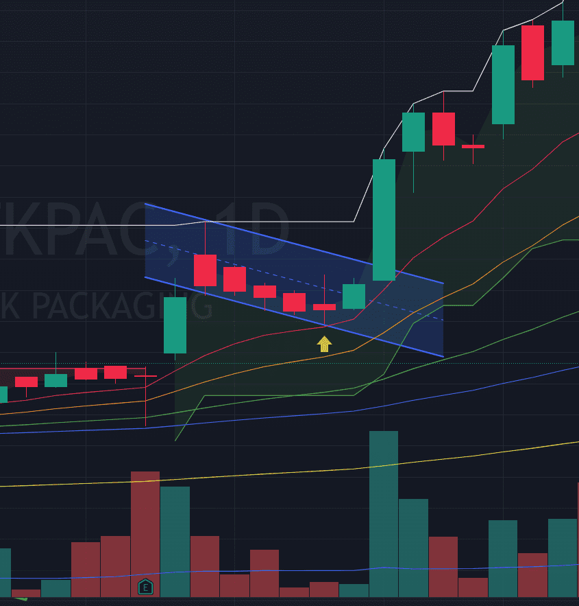

### What is it?
- An “inside bar” pattern is a two-bar price action trading strategy in which the inside bar is smaller and within the high to low range of the prior bar
- the high is lower than the previous bar’s high, and the low is higher than the previous bar’s low
- Its relative position can be at the top, the middle or the bottom of the prior bar.
- The prior bar, the bar before the inside bar, is often referred to as the “mother bar”. You will sometimes see an inside bar referred to as an “ib” and its mother bar referred to as an “mb”.
- it's Range contraction pattern for candles over 5-10 days

> If i want to explain this in simple terms, it represent balance between buyer and sellers for that perticular day, so any movement above that bar will consider as bullish movement.

### When to buy?
- Prefer Range contraction with atleast 4-5 candles
- we are mostly interested in late stage candles in range contraction
- make sure that rate of change should not be more than 2.5%
- Make sure that stock is consoidating at very low risk point
- Make sure stock is close to 10 or 20 day ma
- Put stoploss below Inside bar or below mother bar depend on price action

> Note : Don't use inside bar as setup, use it in combination with other setups to take early entry or building positions or pyramid.

### Reference
- [Youtube: SIMPLE INSIDE BAR STRATEGY](https://www.youtube.com/watch?v=ZYt4d2tO9RE)
- [Web: Insider bar trading](https://priceaction.com/price-action-university/strategies/inside-bar/)

### Examples
#### MoldTack Packaging 220804
- Stock is close to ATH, and in uptrend
- it's above 10 day but very close to ma
- Just broke out of super trend
- Good volume contraction

