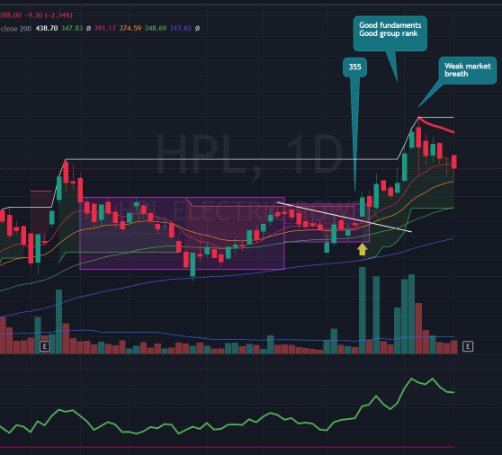

### References

### Overview
- Low Cheat entry is simply low risk entry just before stock is about to breakout of ATH
- This is more preffered because it gave very low risk entry for stock
- It's not traditional setup so trade is not crowded
- Stock mostly likey give ATH breakout within few days so you don't have to spend lot of time consolidating
- Positive point if stock is close to AVWAP line or close to ATH line within 10-15%
- If Range also have some volatility contraction like Example 1, then it's even more powerfull

### When to Enter
- When stock is consolidating in specific range just before ATH breakout, and stock breakout of that range

### When to Exit
- This depend on individual stock price action
- For Stoploss you can just take sl at day's low or low of past few days
- For Selling in profit, just use general selling rules

### Chart Samples
#### Example 1
- So as you can see in above chart you can take entry on range breakout 
- or you can take early entry when market is good to improve your risk reward

- 
