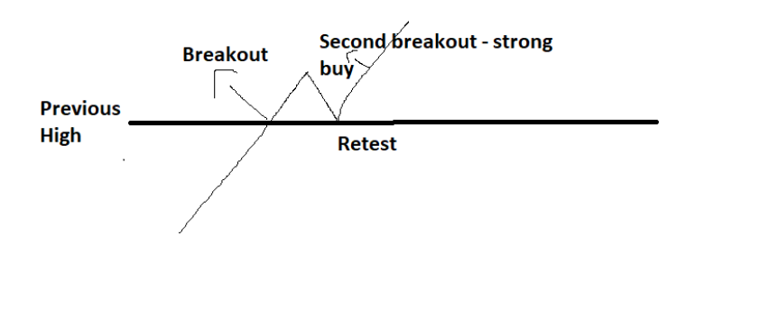
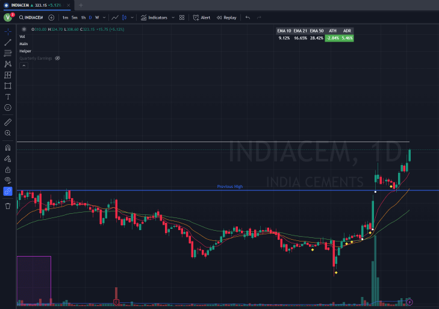

### Retest of Previous High
- After stocks breaks out into new high ground and starts to fall, but fails to go below the previous ATH and takes support at it, it's strong singal
- One more benifit of this setup is that all weak hands are now get shaken out already so rally will be much more powerful then last one

- One more benifit of this setup is if you're already holding position then it's perfect time to pyramid

### When to Enter
- When stock pull back close to 10/21 ma or take support on that and that moving average is perfectly interset with previous high line
- This should give perfect low risk entry

### When to Exit
- Just Use General Selling rules, I don't have anything concrete yet

### Chart Samples
- Will add this in future