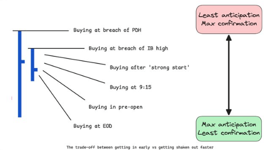

# Inside Bar

## Overview
- An inside bar is a candlestick pattern where the current bar's high and low are completely contained within the previous bar's high and low.
- It indicates a period of consolidation and indecision in the market, often preceding a breakout in either direction.
- **it's basically volatility contraction on smaller time frame**

## How to Trade Inside Bar
- Identify an inside bar pattern on the chart, where the current bar is completely contained within the previous bar.
- Wait for a breakout from the inside bar pattern, which can occur in either direction (upward or downward).
- If the price breaks above the high of the inside bar, it may signal a bullish breakout
- If the price breaks below the low of the inside bar, it may signal a bearish breakout
- Consider using additional technical indicators or chart patterns to confirm the breakout and increase the probability of a successful trade.
- As shown in below image there's no correct way to enter
- all entry points are trade off between capturing a move with a big size vs getting shaken out, or even entring in a move that was never there

