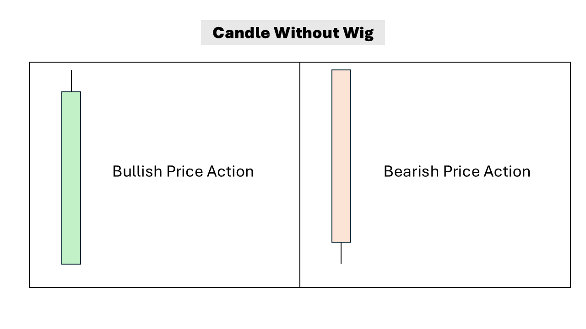

# Price Action

## Candle without Wig

- For buying if stock open with gap up and keep going up with very small wick it's very bullish action and take immediate entry
- Similarly for selling if stock gap up and keep going not even making any wick on top it's good sign of selling pressure, take immediate exit to protect your profit
- **You can use this concept for early selling or buying for swing trading.**
