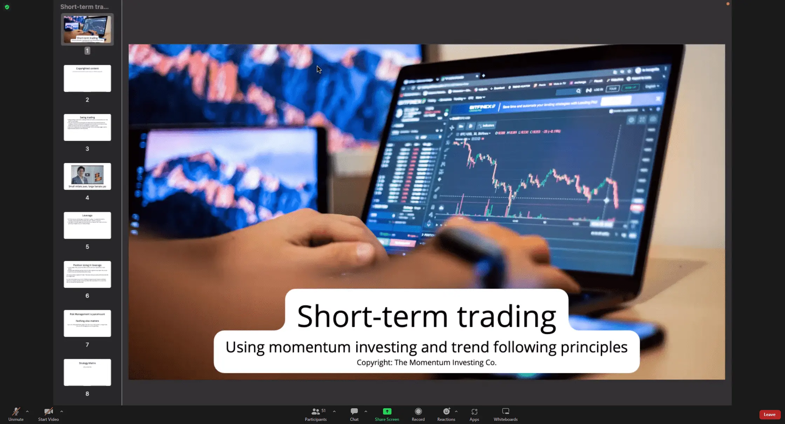

# 11: Short Term Trading

# Swing Trading

# Leverage

# Types of Trading

## Futures

# Price Action Lifecycle

Oliver kell?

1. Voltamp 2. Hikal 3. Sequent Scientific 4. Zomato 5. Adani Enterprises

Homework : Check these stocks in diff time frames Voltamp, Hikal, Zomato adani

Identify the trend using the price action cycle of these stocks in the weekly, daily and 30 min timeframe and notice, how this is fractal in nature. Also, analyse if we are early into the trend in these stocks on the weekly and daily charts

# The Trend Model

### Trading Rules

# Patterns

## Bull Flag

## Bull Panent

# Short selling

## Shorting patterns

### Bear Flag

### Bear Panant

### Head and shoulder

