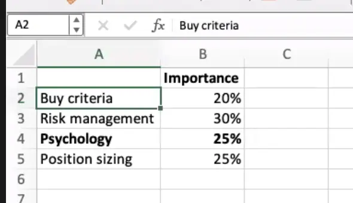

# 9: Psychology

Stock results are not instant so it’s difficult to watch stock, both way even when it goes up and goes down. you’ll have fomo or fear or losing your profit.

> Doncian channels indicator by richard dennis
> 

**The Complete TurtleTrader** 

