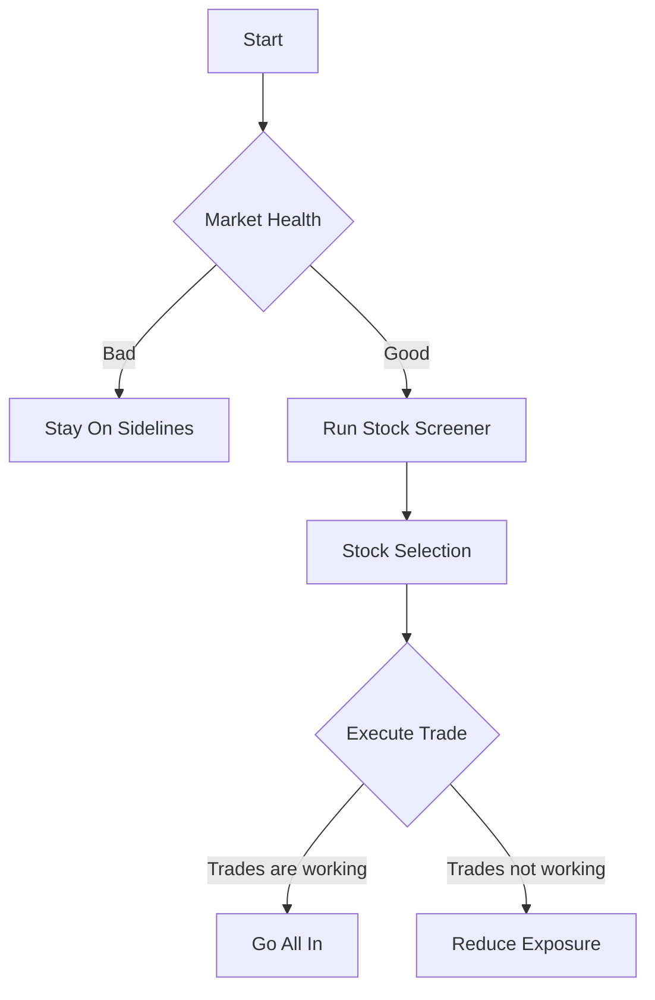

# My Trading process

!!! quote "William J. O'Neil"
    *"Goal of trading is to buy right stock at right time with right size"*

## Process

```mermaid
graph TD
    Start --> MH{Market Health}
    MH --Bad--> StayOnSideLine[Stay On Sidelines]
    MH --Good--> StockScreener[Run Stock Screener]
    StockScreener --> StockSelection[Stock Selection]
    StockSelection--> ExecuteTrade{Execute Trade}
    ExecuteTrade --Trades are working--> PositionSizing[Go All In]
    ExecuteTrade --Trades not working--> ReduceExposure[Reduce Exposure]
```
