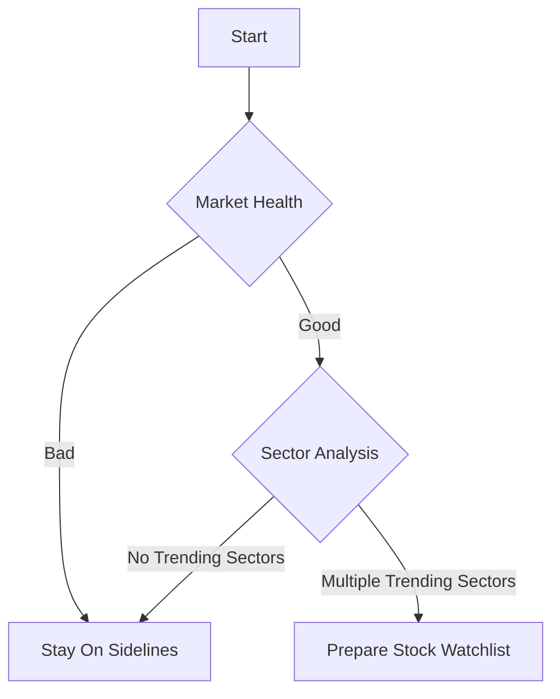
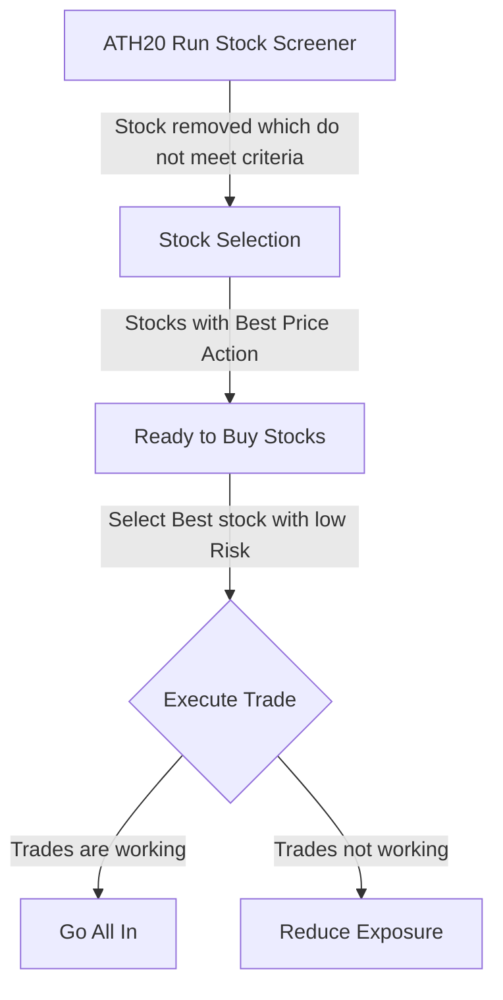

# My Trading process

!!! quote "William J. O'Neil"
    *"Goal of trading is to buy right stock at right time with right size"*

## Market Health Analysis
- Before we start trading, it's crucial to analyze the overall market conditions to check if the market is in a favorable state for trading.

## Stock Selection Process

